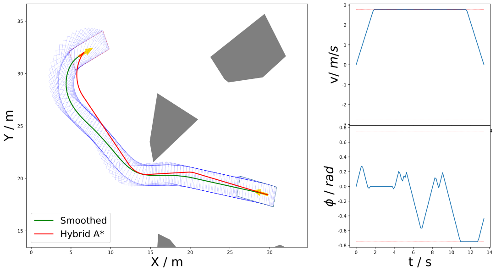
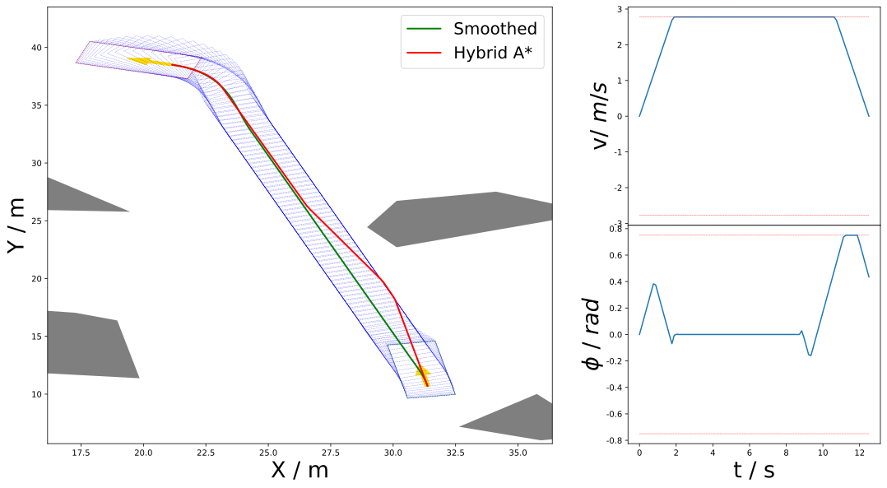
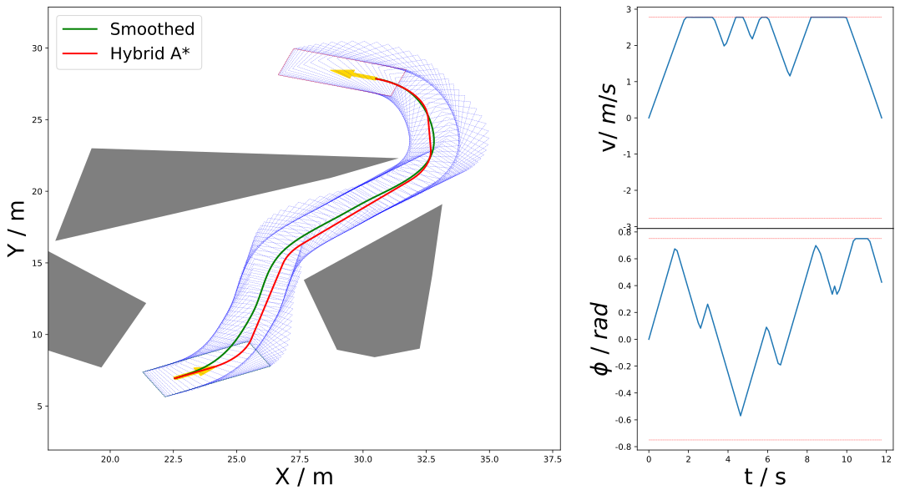

<h1 align="center">OTC Planner</h1>
<h3 align="center">Oriented Travel Corridor-based Parking Planner</h3>

<p align="center">
  <b>Hybrid A* + NLP Smoother for Autonomous Parking</b><br>
  Hybrid A* with Reeds–Shepp analytic expansion and an IPOPT-based trajectory smoother.
  Reproduces all 115 LIOM benchmark cases.
</p>

<p align="center">
  
  
  
  
</p>

---

## Overview

**OTC Planner** provides two core modules for autonomous parking trajectory planning:

| Module | Description |
|--------|-------------|
| **Hybrid A\*** | Heuristic search with Reeds–Shepp analytic expansion; produces a kinematically feasible path through tight parking spaces. |
| **OTCSmoother** | NLP-based trajectory refinement via CasADi + IPOPT; respects vehicle dynamics, collision corridors, and control limits. |

> The Hybrid A\* core relies on a **prebuilt C++ pybind11 module**. Only the compiled `.so` (CPython 3.9, x86\_64 Linux) is distributed — the C++ source is not included.
<div align="center">
  <video src="Figure/OTC_Planner.mp4" width="80%" controls autoplay loop muted></video>
</div>
---

## ⚠️ Platform Requirement

| Field | Value |
|-------|-------|
| **OS** | Linux (x86\_64) |
| **Python** | 3.9 (CPython) |
| **ABI** | `cpython-39-x86_64-linux-gnu` |

The `.so` will **not** load under other Python versions or architectures.

---

## Installation

```bash
git clone <repo-url> && cd OCC_Planner
pip install -r requirements.txt
```

### Dependencies

`numpy`, `casadi`, `matplotlib`, `pandas`, `shapely`, `geopandas`, `aabbtree`, `polytope`, `PyYAML`

---

## Usage

### Reproduce all LIOM benchmark cases (Hybrid A\*)

```bash
python run_liom_benchmark.py
```

Output: `.npy` files in `results/PlanningRes/`.

### Smooth + visualize a single case

```bash
python run_smoother_visualize.py 1            # interactive plot (case 1)
python run_smoother_visualize.py 42 --save    # save SVG to Figure/LIOM_Figure/
```

### Generate an animation GIF

```bash
python scripts/make_teaser_gif.py 1          # creates Figure/teaser_case1.gif
```

---

## Results

<table>
<tr>
  <td align="center"><b>Case 1 (easy)</b></td>
  <td align="center"><b>Case 42 (medium)</b></td>
  <td align="center"><b>Case 100 (difficult)</b></td>
</tr>
<tr>
  <td></td>
  <td></td>
  <td></td>
</tr>
</table>

In each figure:
- **Red path:** raw Hybrid A\* trajectory
- **Green path:** smoothed trajectory (EmbodySmoother)
- **Top-right subplot:** velocity profile &nbsp;|&nbsp; **Bottom-right subplot:** steering angle

---

## Repository structure

```
OCC_Planner/
├── occ_planner/                      ← core Python modules + .so
│   ├── HybridAstar.cpython-39-x86_64-linux-gnu.so   ← prebuilt C++ module
│   ├── HybridAstarpy.py             ← Hybrid A* planner
│   ├── Smoother_v2.py               ← EmbodySmoother (CasADi NLP)
│   ├── Node.py                      ← StateNode for A* search
│   ├── KinematicModel.py            ← vehicle model
│   ├── TPCAP_Cases.py               ← case loader & visualizer
│   ├── map_test.py                  ← grid map builder
│   ├── Optimize_util.py             ← constants & utilities
│   ├── down_sample.py               ← trajectory down-sampling
│   └── config/
│       ├── config.yaml              ← planner parameters
│       └── read_config.py           ← YAML config loader
├── benchmarks/LIOM/                  ← 115 parking-case CSV files
├── results/                          ← output directory
├── Figure/                           ← generated figures & GIFs
├── scripts/
│   └── make_teaser_gif.py           ← animation generator
├── run_liom_benchmark.py            ← reproduce all LIOM cases
├── run_smoother_visualize.py        ← smooth + visualize a case
├── requirements.txt
└── LICENSE
```

---

## Citation

If you use this work in an academic context, please cite:

```bibtex
@inproceedings{...,
  title     = {OCC Planner: Online Corridor-based Car Parking Planner},
  author    = {Du, Yuhao and Li, Bai and ...},
  booktitle = {...
  year      = {2025}
}
```

---

## License

BSD 2-Clause License. See `LICENSE`.
